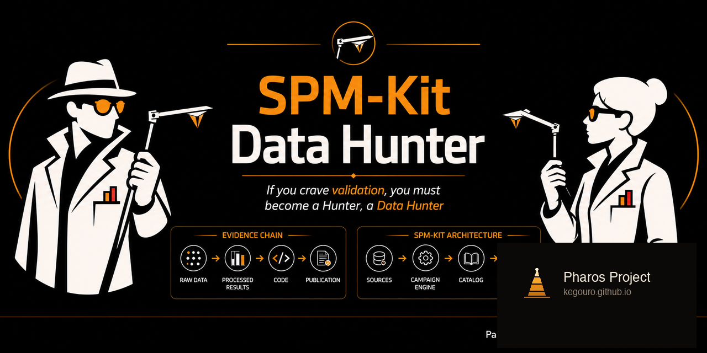
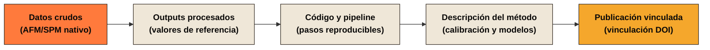
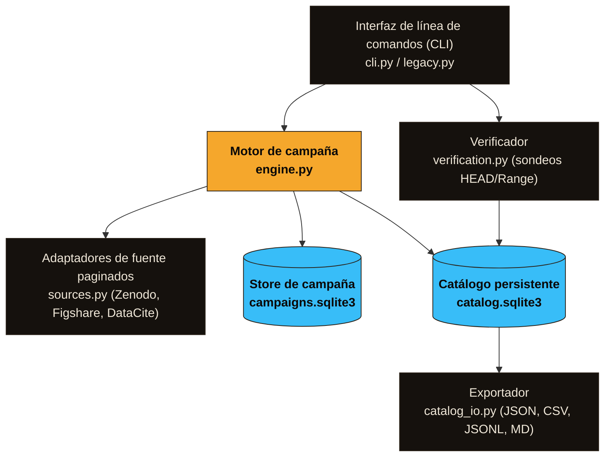

<p align="center">
  
</p>

# SPM-Kit Data Hunter

*Descubre, cataloga y clasifica datasets públicos AFM/SPM para validación de software científico.*

<p align="center">
  
</p>

[](LICENSE)
[](https://www.python.org/)
[](https://github.com/kegouro/spmkit-data-hunter)

<p align="center">
  <a href="README.es.md"></a>
  <a href="README.md"></a>
</p>

---

## Qué es esto

SPM-Kit Data Hunter busca en repositorios científicos públicos datasets
AFM/SPM, los cataloga con metadata estructural e inventarios de archivos,
clasifica su utilidad científica, y los descarga selectivamente.

Apunta a la cadena de evidencia necesaria para validar software científico:



Un archivo AFM crudo prueba un lector. Un archivo crudo junto con datos
procesados, código y una publicación vinculada puede validar un algoritmo de
análisis. Data Hunter registra qué puede realmente soportar cada dataset, sin
pretender establecer ground truth.

---

## Por qué existe

Validar software AFM/SPM es más difícil que encontrar archivos de microscopía.

- Los archivos crudos están dispersos entre Zenodo, Figshare, repositorios
  institucionales y archivos suplementarios.
- La mayoría de los datasets públicos falta al menos un eslabón en la cadena
  de validación: sin referencia procesada, sin método, sin código, sin DOI.
- Un CSV llamado `roughness_results.csv` junto a un archivo `.nid` crudo
  parece prometedor, pero sin documentación de unidades, calibración y
  parámetros, es una referencia débil en el mejor de los casos.
- La metadata de los repositorios es no estructurada, inconsistente, y rara
  vez lista los formatos de instrumento o los pipelines de procesamiento.

Data Hunter fue construido para resolver esto: descubrimiento programático que
distingue fixtures de lectores de benchmarks de análisis, preserva provenance,
y trabaja a escala durante horas o hasta que las fuentes se agoten.

---

## Idea central: cadenas de evidencia

Data Hunter puntúa cada registro según lo que contiene:

| Señal de evidencia | Contribución |
|---|---|
| Archivo AFM/SPM nativo | Datos crudos presentes |
| Outputs procesados | Valores o imágenes de referencia existen |
| Código o notebooks | Pipeline de procesamiento es recuperable |
| Descripción del método | Parámetros, calibración o modelo documentados |
| DOI | Vinculación con publicación |

Los registros se puntúan y clasifican automáticamente. Gold y Silver son
etiquetas heurísticas: describen qué tan completa *parece* la cadena de
evidencia, no qué tan correctos son los datos.

---

## Qué hace realmente Data Hunter

### Descubrimiento

- Busca en APIs públicas (Zenodo, Figshare, DataCite).
- Usa presets de consultas curadas o consultas personalizadas.
- Sin límites ocultos de registros. Ejecutar hasta agotar fuentes o alcanzar
  un presupuesto.

### Catalogación

- Construye un catálogo SQLite persistente de registros, archivos, metadata y
  puntajes.
- Clasificación de nombres de archivo consciente de tokens (`.jpk-force`,
  `.gwy`, `.sxm`) que evita trampas de subcadena como `drawings.csv → raw`.
- Registra categorías de archivo: `raw`, `processed`, `code`, `documentation`,
  `archive`, `image`, `other`.

### Clasificación y triaje

Cada registro recibe:

- **Filtro de relevancia de dominio** — ¿es realmente material AFM/SPM?
- **Puntaje de benchmark** (0–100) — ¿qué tan completa está la cadena de
  evidencia?
- **Nivel heurístico** — Gold, Silver o Bronze.
- **Clase de utilidad** — mapea a casos de uso científico (ver abajo).

### Verificación ligera

- Sondea archivos remotos con HEAD o peticiones de un byte de rango.
- Marca entradas inaccesibles, vacías, redirigidas o con tamaño inconsistente.
- No reemplaza la verificación de checksums después de la descarga completa.

### Descarga selectiva

- Plan primero: previsualiza conteo de registros, archivos y tamaño estimado.
- Descarga por nivel (`--level gold silver`), categoría, o ambos.
- Límites de tamaño configurables por archivo y por registro.
- Descargas ilimitadas requieren confirmación explícita
  (`--accept-unbounded-downloads`).
- Soporte de checksums del repositorio más SHA-256 local.

### Flujo de campaña

- **Checkpoints durables** en SQLite. Un checkpoint de página avanza solo
  después de que la página completa se persiste. Las páginas reproducidas son
  seguras; las escrituras son idempotentes.
- **Reanudable** — pausa con `Ctrl+C`, detén desde otra terminal, reanuda
  después.
- **Controles de presupuesto** — ejecutar por límite de tiempo (`1h`, `8h`) o
  conteo de registros.
- **Heartbeats** y log de eventos.
- **Exportación** del catálogo a JSON, JSONL, CSV, Markdown y SQLite.

### Seguridad y reproducibilidad

- Descargas solo por HTTPS con validación de destino IP (no localhost, no
  rangos privados).
- Cero límites ocultos de búsqueda.
- Una partición de API fallida nunca se marca como agotada: se reintenta al
  reanudar.
- Descubrimiento y descarga son operaciones deliberadamente separadas.

---

## Taxonomía orientada a validación

Data Hunter asigna una **clase de utilidad** a cada registro. Esta es la
clasificación más importante: indica qué puede realmente soportar el registro.

| Clase de utilidad | Criterios | Válido para |
|---|---|---|
| `benchmark_ready` | Assets crudos y procesados distintos + método/código | Candidato a validación de análisis (requiere revisión humana) |
| `crosscheck_candidate` | Assets crudos y procesados distintos, método/código incompleto | Comparación preliminar, seguimiento manual |
| `reader_fixture` | Datos crudos/nativos, sin referencia procesada independiente | Tests de lector, parser, canal y robustez |
| `processed_reference_only` | Output procesado, sin input crudo recuperable | Contexto numérico, ejemplos de formato, trazabilidad de literatura |
| `documentation_only` | Paper, protocolo, script o README sin datos utilizables | Expansión de consultas, provenance, descubrimiento de métodos |
| `incomplete` | Evidencia insuficiente o ambigua | Triaje manual, refinamiento de consultas |
| `rejected` | Corrupto, vacío, inseguro, irrelevante o inaccesible | Ninguno |

> Gold, Silver y Bronze son etiquetas compactas de conveniencia que combinan
> el puntaje de benchmark con la clase de utilidad. **No** son declaraciones
> de corrección científica. Prefiere la clase de utilidad para la toma de
> decisiones.

Lee la taxonomía completa en
[`docs/VALIDATION_TAXONOMY.md`](docs/VALIDATION_TAXONOMY.md).

---

## Highlights de features

<table>
<tr><td><b>APIs oficiales</b></td><td>Sin scraping. Todo el descubrimiento usa APIs REST públicas.</td></tr>
<tr><td><b>Catálogo persistente</b></td><td>SQLite almacena registros normalizados, inventarios de archivos, puntajes y provenance.</td></tr>
<tr><td><b>Campañas durables</b></td><td>Reanuda tras interrupción. Los checkpoints son granulares por página e idempotentes.</td></tr>
<tr><td><b>Búsqueda exhaustiva</b></td><td>Sin límites ocultos de 20/25/30 registros. Detén con presupuestos de tiempo o registros.</td></tr>
<tr><td><b>Filtro de relevancia</b></td><td>Detección determinista, offline, de relevancia AFM/SPM antes del puntaje.</td></tr>
<tr><td><b>Clasificación consciente de tokens</b></td><td>Matching por límites de palabra previene que <code>raw</code> coincida con <code>draw</code>.</td></tr>
<tr><td><b>Descargas con checksums</b></td><td>Checksums del repositorio + SHA-256 local. Omite archivos ya descargados.</td></tr>
<tr><td><b>Inventario de archivos</b></td><td>Inspecciona contenido de zip/tar sin extraer (<code>--inspect-archives</code>).</td></tr>
<tr><td><b>Múltiples exportaciones</b></td><td>JSON, JSONL, CSV, Markdown y SQLite. Todas son vistas; regenera en cualquier momento.</td></tr>
<tr><td><b>Verificación remota</b></td><td>Sondeos HEAD/range detectan links muertos, archivos vacíos y tamaños inconsistentes.</td></tr>
<tr><td><b>Seguro por defecto</b></td><td>Descargas ilimitadas requieren un flag explícito de confirmación.</td></tr>
</table>

---

## Instalación

```bash
git clone https://github.com/kegouro/spmkit-data-hunter.git
cd spmkit-data-hunter
python3 -m venv .venv
source .venv/bin/activate
pip install -e ".[dev]"
```

En Windows PowerShell:

```powershell
.venv\Scripts\Activate.ps1
```

### Verificar

```bash
spmkit-data-hunter doctor
spmkit-data-hunter sources list
pytest
ruff check .
```

`doctor` reporta si los tokens opcionales de API están configurados (nunca
imprime sus valores) y lista las capacidades de fuentes detectadas.

---

## Inicio rápido

### Campaña de descubrimiento de una hora

```bash
# Crear
spmkit-data-hunter campaign create afm-1h \
  --preset all \
  --source all \
  --max-runtime 1h \
  --max-records 0 \
  --output spm_benchmarks

# Ejecutar
spmkit-data-hunter campaign run afm-1h --output spm_benchmarks
```

La campaña se detiene en el checkpoint de página seguro más cercano cuando se
acaba la hora.

### Reanudar una campaña

```bash
spmkit-data-hunter campaign resume afm-1h --output spm_benchmarks
```

### Revisar estado

```bash
spmkit-data-hunter campaign status afm-1h
spmkit-data-hunter campaign list
```

### Sondear archivos remotos sin descargar

```bash
spmkit-data-hunter campaign verify afm-1h
```

Usa HEAD (con fallback a range de un byte) para marcar entradas inalcanzables,
vacías o con tamaño inconsistente. La corrección científica del contenido no
se evalúa.

### Planificar descargas

```bash
spmkit-data-hunter download plan afm-1h \
  --level gold silver \
  --category raw processed
```

Reporta conteo de registros, archivos, tamaño conocido y archivos con tamaño
desconocido. Nada se descarga.

### Ejecutar descargas selectivas

```bash
spmkit-data-hunter download run afm-1h \
  --level gold silver \
  --category raw processed \
  --max-file-gb 2 \
  --max-record-gb 20 \
  --inspect-archives
```

### Descarga ilimitada

```bash
spmkit-data-hunter download run afm-1h \
  --level gold \
  --max-file-gb 0 \
  --max-record-gb 0 \
  --accept-unbounded-downloads
```

El flag `--accept-unbounded-downloads` es una confirmación deliberada de
seguridad, no un filtro científico.

### Pausar, detener, controlar

```bash
spmkit-data-hunter campaign pause afm-1h
spmkit-data-hunter campaign stop afm-1h
```

`Ctrl+C` durante una ejecución es equivalente a pausa: la campaña se detiene
en el último checkpoint de página confirmado.

### Modo legacy con flags

Las invocaciones compatibles hacia atrás con solo flags siguen soportadas:

```bash
spmkit-data-hunter --preset force --source all --limit 0 --top 50
```

En modo legacy, `--limit 0` busca hasta que la fuente no devuelva más
resultados. Las campañas son fuertemente preferidas para ejecuciones largas:
el modo legacy no persiste checkpoints de página.

---

## Flujos de trabajo recomendados

### "Quiero archivos AFM/SPM crudos para probar lectores"

```bash
spmkit-data-hunter campaign create reader-fm \
  --preset topography force \
  --source zenodo figshare \
  --max-runtime 2h \
  --max-records 0

spmkit-data-hunter campaign run reader-fm

# Filtrar solo archivos crudos
spmkit-data-hunter download plan reader-fm \
  --level gold silver bronze \
  --category raw
```

### "Quiero benchmarks de análisis candidatos"

```bash
spmkit-data-hunter campaign create bench-hunt \
  --preset all \
  --source all \
  --max-runtime 0 \
  --max-records 500

spmkit-data-hunter campaign run bench-hunt

# Descargar solo registros Gold con assets crudos y procesados
spmkit-data-hunter download run bench-hunt \
  --level gold \
  --category raw processed code
```

### "Quiero una campaña nocturna de larga duración"

```bash
spmkit-data-hunter campaign create overnight \
  --preset all \
  --source all \
  --max-runtime 8h \
  --max-records 0

spmkit-data-hunter campaign run overnight
# Puede pausarse/reanudarse/detenerse en cualquier momento
```

---

## Estructura de output

```
spm_benchmarks/
├── catalog.sqlite3          # Registros normalizados e inventarios de archivos
├── campaigns.sqlite3        # Configs de campaña, checkpoints, eventos, stats
├── catalog.json             # Vistas de exportación (regenera con campaign export)
├── catalog.jsonl
├── catalog.csv
├── REPORT.md
└── datasets/                # Archivos descargados organizados por registro
```

- `catalog.sqlite3` es la fuente de verdad para registros y archivos.
- `campaigns.sqlite3` almacena progreso de campaña, checkpoints y eventos.
- Los archivos de exportación son vistas reemplazables. Elimina y regenera en
  cualquier momento.
- SQLite usa modo WAL. Copia las bases de datos junto con `-wal` y `-shm`
  solo cuando el proceso está detenido.

## Arquitectura



Lee [`docs/ARCHITECTURE.md`](docs/ARCHITECTURE.md) para detalles de módulos e invariantes.

## Documentación

- [Guía de uso](docs/usage-guide.md) — Referencia completa (Markdown, canónico)
- [Guía de uso PDF](docs/usage-guide.pdf) — Compañero imprimible (12 páginas)
- [Biblia de caza de datos científicos](SCIENTIFIC_DATA_HUNTING_BIBLE.md) — Doctrina de validación
- [Taxonomía de validación](docs/VALIDATION_TAXONOMY.md)
- [Guía de adaptadores de fuente](docs/SOURCE_ADAPTER_GUIDE.md)
- [Modelo de amenazas](docs/THREAT_MODEL.md)

---

## Presets de consulta

| Preset | Alcance |
|---|---|
| `all` | Descubrimiento amplio AFM/SPM entre modalidades |
| `topography` | Mapas de altura, perfiles, rugosidad, comparaciones con Gwyddion |
| `force` | Curvas de fuerza, calibración, adhesión, módulo, WLC/FJC |
| `kpfm` | Potencial de superficie y datasets de sonda Kelvin |
| `grains` | Segmentación, partículas, análisis de granos |
| `resonance` | Sintonía térmica de cantilever y ajuste de resonancia |

Los presets pueden combinarse y extenderse con consultas personalizadas:

```bash
spmkit-data-hunter campaign create custom \
  --preset force kpfm \
  --query "single molecule force spectroscopy raw processed" \
  --query "JPK force curve analysis notebook"
```

---

## Fuentes soportadas

| Fuente | Rol | Inventario de archivos | Checkpoint | Auth |
|---|---|---|---|---|
| Zenodo | Repositorio directo | Sí | Página | Opcional |
| Figshare | Repositorio directo | Sí | Página | Opcional |
| DataCite | Índice de metadata | Usualmente no | Cursor | No requerido |

Los registros de DataCite se retienen como evidencia de metadata. No se
representan como paquetes de benchmark completamente hidratados porque
típicamente carecen de inventarios de archivos.

Adaptadores planeados: OSF, Dataverse, Dryad, InvenioRDM, DSpace 7.
Ver [`docs/ROADMAP.md`](docs/ROADMAP.md).

---

## Categorías de archivo

Los archivos se clasifican por extensión y análisis de nombre consciente de tokens:

| Categoría | Ejemplos |
|---|---|
| `raw` | `.nid`, `.nhf`, `.gwy`, `.jpk`, `.jpk-force`, `.spm`, `.ibw`, `.sxm`, `.mdt`, `.sm4` |
| `processed` | `.csv`, `.tsv`, `.xlsx`, `.json`, `.tif`, `.h5`, `.npy`, `.npz`, `.mat` |
| `code` | `.py`, `.ipynb`, `.m`, `.r`, `.jl`, `.sh`, `.cpp`, `.toml` |
| `documentation` | `.md`, `.pdf`, `.tex`, `.rst`, `.docx`, `.html` |
| `image` | `.png`, `.jpg`, `.svg`, `.bmp`, `.webp` |
| `archive` | `.zip`, `.tar.gz`, `.7z`, `.rar` |

Las extensiones ambiguas (`.csv`, `.h5`, `.tif`) reciben la etiqueta
`processed` solo cuando ninguna señal explícita de `raw` la suprime.

---

## Filosofía de validación

1. **Descubrimiento no es validación.** Un resultado de búsqueda, un DOI o un
   archivo descargado no es un benchmark. Son candidatos que requieren
   revisión humana.
2. **Archivos solo crudos son fixtures de lector.** Prueban parsers, manejo de
   canales y robustez. No pueden validar algoritmos de análisis.
3. **Valores procesados son referencias, no verdad absoluta.** Un CSV de
   rugosidad de otro laboratorio es evidencia, no una respuesta dorada.
   Unidades, calibración y parámetros de procesamiento deben registrarse para
   comparación.
4. **Gwyddion es una referencia, no un oráculo.** Es excelente para muchas
   cross-checks de procesamiento de imagen cuando se preservan versión,
   parámetros y orden de operaciones. No es una referencia universal para
   workflows de espectroscopía de fuerza o calibración de instrumento.
5. **La revisión científica sigue siendo necesaria.** Data Hunter proporciona
   estructura, no conclusiones.

Lee la doctrina completa: [`SCIENTIFIC_DATA_HUNTING_BIBLE.md`](SCIENTIFIC_DATA_HUNTING_BIBLE.md).

---

## Ecosistema

SPM-Kit Data Hunter es parte del ecosistema SPM-Kit:

| Repositorio | Función |
|---|---|
| **[spmkit](https://github.com/kegouro/spmkit)** | Motor numérico, API Python, CLI y *workspace* gráfico (Fathom) |
| **[spmkit-validation](https://github.com/kegouro/spmkit-validation)** | Arnés externo de validación caja negra que preserva evidencia reproducible |
| **[spmkit-phantoms](https://github.com/kegouro/spmkit-phantoms)** | Superficies sintéticas deterministas con *ground truth* conocido |
| **[spmkit-data-hunter](https://github.com/kegouro/spmkit-data-hunter)** (este repo) | Descubrimiento, inventario y triaje de datasets públicos AFM/SPM para validación |

Data Hunter descubre material público que puede soportar tests de lectores, cross-checks y manifests de validación. No realiza análisis AFM por sí mismo, y descubrimiento no equivale a validación.

> **Find the evidence → define the truth → test the system externally → preserve the result.**

[Explora el portal completo del ecosistema](https://kegouro.github.io/spmkit/ecosystem/)
para conocer los límites de cada componente, contratos de artefactos, instalación
y tutoriales de workflows reproducibles.

## Agradecimientos

José Labarca Baeza es el creador, autor y desarrollador principal.

Tomás Corrales y el SPM Lab de la Universidad Técnica Federico Santa María proporcionaron datasets experimentales seleccionados y contexto de laboratorio durante el desarrollo y la evaluación de SPM-Kit.

María Saavedra Fredes y Benjamin Schleyer ayudaron a localizar y compartir datasets candidatos para las campañas de validación.

Estos agradecimientos no asignan autoría del software ni propiedad institucional.
Tampoco implican que todo dataset localizado fuese usado, aceptado, redistribuible o
científicamente adecuado.

---

## Desarrollo

```bash
pip install -e ".[dev]"
pytest
ruff check .
ruff format --check .
```

Dependencias: `requests`, `tqdm`. Dev: `pytest`, `ruff`.

Cada falso positivo o caso límite de API real debe convertirse en un test de regresión.

---

## Roadmap

| Versión | Foco |
|---|---|
| **2.2** (actual) | Motor de campaña, checkpoints de página, filtro de relevancia de dominio, taxonomía de utilidad |
| **2.3** | Más adaptadores de fuente (OSF, Dataverse, Dryad), árbol de partición de consultas |
| **2.4** | Inteligencia de formato: inspección MIME/magic-byte, análisis de contenido de archivos |
| **2.5** | Manifests de benchmark revisados humanos, integración con validación SPM-Kit |

Ver [`docs/ROADMAP.md`](docs/ROADMAP.md).

---

## Contribuir

Reportes de bugs, adaptadores de fuente, inteligencia de formato y mejoras de
clasificación son bienvenidos. Lee [`CONTRIBUTING.md`](CONTRIBUTING.md) y la
[Biblia de caza de datos científicos](SCIENTIFIC_DATA_HUNTING_BIBLE.md) primero.

---

## Citar

[`CITATION.cff`](CITATION.cff)

---

## Licencia

MIT. Ver [`LICENSE`](LICENSE).

<br>

> *Descubrimiento no es validación. Solo crudo es limitado. Los valores
> procesados son referencias, no verdad absoluta. La revisión científica
> sigue siendo necesaria.*
