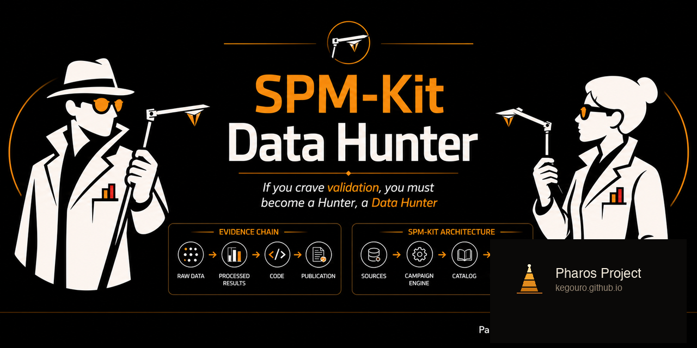
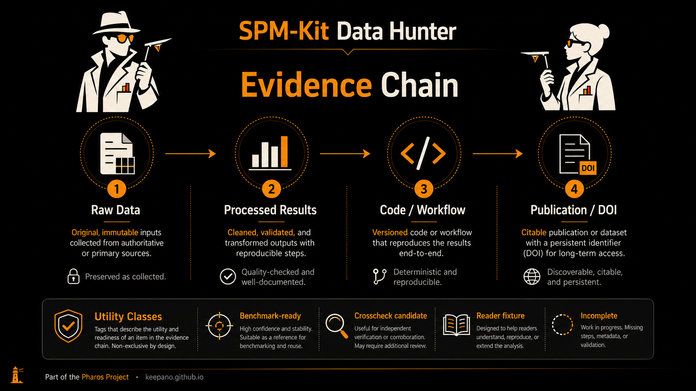
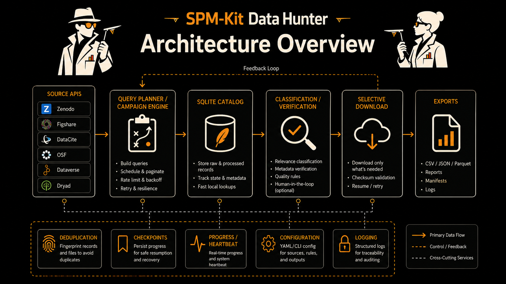

<p align="center">
  
</p>

# SPM-Kit Data Hunter

*Discover, catalog, and triage public AFM/SPM datasets for scientific software validation.*

<p align="center">
  
</p>

[](LICENSE)
[](https://www.python.org/)
[](https://github.com/kegouro/spmkit-data-hunter)

---

## What is this?

SPM-Kit Data Hunter searches public scientific repositories for AFM/SPM
datasets, catalogs them with structural metadata and file inventories,
classifies their scientific utility, and selectively downloads them.

It targets the evidence chain needed to validate scientific software:

<p align="center">
  
</p>

A raw AFM file tests a reader. A raw file alongside processed data, code,
and a linked publication can validate an analysis algorithm. Data Hunter
records what each dataset can actually support, without pretending to
establish ground truth.

---

## Why this exists

Validating AFM/SPM software is harder than finding microscopy files.

- Raw files are scattered across Zenodo, Figshare, institutional repositories,
  and supplementary archives.
- Most public datasets are missing at least one link in the validation chain:
  no processed reference, no method, no code, no DOI.
- A CSV named `roughness_results.csv` next to a raw `.nid` file looks
  promising, but without documentation of units, calibration, and
  parameters, it is a weak reference at best.
- Repository metadata is unstructured, inconsistent, and rarely lists
  instrument formats or processing pipelines.

Data Hunter was built to solve this: programmatic discovery that distinguishes
reader fixtures from analysis benchmarks, preserves provenance, and works
at scale over hours or until sources are exhausted.

---

## Core idea: chains of evidence

Data Hunter scores each record by what it contains:

| Evidence signal | Contribution |
|---|---|
| Native AFM/SPM file | Raw data present |
| Processed outputs | Reference values or images exist |
| Code or notebooks | Processing pipeline is recoverable |
| Method description | Parameters, calibration, or model documented |
| DOI | Publication linkage |

Records are scored and classified automatically. Gold and Silver are heuristic
labels — they describe how complete the evidence chain *appears*, not how
correct the data is.

---

## What Data Hunter actually does

### Discovery

- Searches public APIs (Zenodo, Figshare, DataCite).
- Uses curated query presets or custom queries.
- No hidden record limits. Run until sources are exhausted or a budget is
  reached.

### Cataloging

- Builds a persistent SQLite catalog of records, files, metadata, and scores.
- Token-aware filename classification (`.jpk-force`, `.gwy`, `.sxm`) that
  avoids substring traps like `drawings.csv → raw`.
- Records file categories: `raw`, `processed`, `code`, `documentation`,
  `archive`, `image`, `other`.

### Classification & triage

Every record receives:

- **Domain relevance gate** — is it actually AFM/SPM material?
- **Benchmark score** (0–100) — how complete is the evidence chain?
- **Heuristic level** — Gold, Silver, or Bronze.
- **Utility class** — maps to scientific use cases (see below).

### Lightweight verification

- Probes remote files with HEAD or one-byte range requests.
- Flags inaccessible, empty, redirected, or size-mismatched entries.
- Does not replace checksum verification after full download.

### Selective download

- Plan first: preview record count, file count, and estimated size.
- Download by level (`--level gold silver`), category, or both.
- Configurable per-file and per-record size limits.
- Unbounded downloads require explicit acknowledgment (`--accept-unbounded-downloads`).
- Repository checksum support plus local SHA-256.

### Campaign workflow

- **Durable checkpoints** in SQLite. A page checkpoint advances only after the
  entire page is persisted. Replayed pages are safe; writes are idempotent.
- **Resumable** — pause with `Ctrl+C`, stop from another terminal, resume later.
- **Budget controls** — run by time limit (`1h`, `8h`) or record count.
- **Heartbeats** and event log.
- **Export** catalog to JSON, JSONL, CSV, Markdown, and SQLite.

### Safety & reproducibility

- HTTPS-only downloads with IP destination validation (no localhost, no
  private ranges).
- Zero hidden search caps.
- A failed API partition is never marked exhausted — retried on resume.
- Discovery and download are deliberately separate operations.

---

## Validation-oriented taxonomy

Data Hunter assigns a **utility class** to every record. This is the most
important classification field — it tells you what the record can actually
support.

| Utility class | Criteria | Valid for |
|---|---|---|
| `benchmark_ready` | Distinct raw and processed assets + method/code | Analysis validation candidate (requires human review) |
| `crosscheck_candidate` | Distinct raw and processed assets, incomplete method/code | Preliminary comparison, manual follow-up |
| `reader_fixture` | Raw/native data, no independent processed reference | Reader, parser, channel, and robustness tests |
| `processed_reference_only` | Processed output, no recoverable raw input | Numerical context, format examples, literature tracing |
| `documentation_only` | Paper, protocol, script, or README without usable data | Query expansion, provenance, method discovery |
| `incomplete` | Insufficient or ambiguous evidence | Manual triage, query refinement |
| `rejected` | Corrupt, empty, unsafe, irrelevant, or inaccessible | None |

> Gold, Silver, and Bronze are compact convenience labels that combine
> benchmark score with utility class. They are **not** declarations of
> scientific correctness. Prefer the utility class for decision-making.

Read the full taxonomy at
[`docs/VALIDATION_TAXONOMY.md`](docs/VALIDATION_TAXONOMY.md).

---

## Feature highlights

<table>
<tr><td><b>Official APIs</b></td><td>No scraping. All discovery uses public REST APIs.</td></tr>
<tr><td><b>Persistent catalog</b></td><td>SQLite stores normalized records, file inventories, scores, and provenance.</td></tr>
<tr><td><b>Durable campaigns</b></td><td>Resume after interruption. Checkpoints are page-granular and idempotent.</td></tr>
<tr><td><b>Exhaustive search</b></td><td>No hidden 20/25/30-record caps. Stop with time or record budgets.</td></tr>
<tr><td><b>Domain relevance gate</b></td><td>Deterministic, offline AFM/SPM relevance detection before scoring.</td></tr>
<tr><td><b>Token-aware classification</b></td><td>Word-boundary matching prevents <code>raw</code> from matching <code>draw</code>.</td></tr>
<tr><td><b>Checksum-aware downloads</b></td><td>Repository checksums + local SHA-256. Skip already-downloaded files.</td></tr>
<tr><td><b>Archive inventory</b></td><td>Inspect zip/tar contents without extraction (<code>--inspect-archives</code>).</td></tr>
<tr><td><b>Multiple exports</b></td><td>JSON, JSONL, CSV, Markdown, and SQLite exports. All are views; regenerate anytime.</td></tr>
<tr><td><b>Remote verification</b></td><td>HEAD/range probes detect dead links, empty files, and size mismatches.</td></tr>
<tr><td><b>Safe by default</b></td><td>Unbounded downloads require an explicit acknowledgment flag.</td></tr>
</table>

---

## Installation

```bash
git clone https://github.com/kegouro/spmkit-data-hunter.git
cd spmkit-data-hunter
python3 -m venv .venv
source .venv/bin/activate
pip install -e ".[dev]"
```

On Windows PowerShell:

```powershell
.venv\Scripts\Activate.ps1
```

### Verify

```bash
spmkit-data-hunter doctor
spmkit-data-hunter sources list
pytest
ruff check .
```

`doctor` reports whether optional API tokens are configured (never prints
their values) and lists detected source capabilities.

---

## Quick start

### One-hour discovery campaign

```bash
# Create
spmkit-data-hunter campaign create afm-1h \
  --preset all \
  --source all \
  --max-runtime 1h \
  --max-records 0 \
  --output spm_benchmarks

# Run
spmkit-data-hunter campaign run afm-1h --output spm_benchmarks
```

The campaign stops at the nearest safe page checkpoint when the hour is up.

### Resume a campaign

```bash
spmkit-data-hunter campaign resume afm-1h --output spm_benchmarks
```

### Check status

```bash
spmkit-data-hunter campaign status afm-1h
spmkit-data-hunter campaign list
```

### Probe remote files without downloading

```bash
spmkit-data-hunter campaign verify afm-1h
```

Uses HEAD (falling back to one-byte range) to flag unreachable, empty, or
size-mismatched entries. Scientific content correctness is not evaluated.

### Plan downloads

```bash
spmkit-data-hunter download plan afm-1h \
  --level gold silver \
  --category raw processed
```

Reports record count, file count, known size, and files with unknown size.
Nothing is downloaded.

### Execute selective downloads

```bash
spmkit-data-hunter download run afm-1h \
  --level gold silver \
  --category raw processed \
  --max-file-gb 2 \
  --max-record-gb 20 \
  --inspect-archives
```

### Unbounded download

```bash
spmkit-data-hunter download run afm-1h \
  --level gold \
  --max-file-gb 0 \
  --max-record-gb 0 \
  --accept-unbounded-downloads
```

The `--accept-unbounded-downloads` flag is a deliberate safety acknowledgment,
not a scientific filter.

### Pause, stop, control

```bash
spmkit-data-hunter campaign pause afm-1h
spmkit-data-hunter campaign stop afm-1h
```

`Ctrl+C` during a run is equivalent to pause — the campaign stops at the last
committed page checkpoint.

### Legacy flag mode

Backward-compatible flag-only invocations remain supported:

```bash
spmkit-data-hunter --preset force --source all --limit 0 --top 50
```

In legacy mode, `--limit 0` searches until the source returns no more results.
Campaigns are strongly preferred for long runs — legacy mode does not persist
page checkpoints.

---

## Recommended workflows

### "I want raw AFM/SPM files to test readers"

```bash
spmkit-data-hunter campaign create reader-fm \
  --preset topography force \
  --source zenodo figshare \
  --max-runtime 2h \
  --max-records 0

spmkit-data-hunter campaign run reader-fm

# Filter for raw files only
spmkit-data-hunter download plan reader-fm \
  --level gold silver bronze \
  --category raw
```

### "I want candidate analysis benchmarks"

```bash
spmkit-data-hunter campaign create bench-hunt \
  --preset all \
  --source all \
  --max-runtime 0 \
  --max-records 500

spmkit-data-hunter campaign run bench-hunt

# Download only Gold records with raw and processed assets
spmkit-data-hunter download run bench-hunt \
  --level gold \
  --category raw processed code
```

### "I want a long-running overnight campaign"

```bash
spmkit-data-hunter campaign create overnight \
  --preset all \
  --source all \
  --max-runtime 8h \
  --max-records 0

spmkit-data-hunter campaign run overnight
# Can be paused/resumed/stopped at any time
```

---

## Output structure

```
spm_benchmarks/
├── catalog.sqlite3          # Normalized records and file inventories
├── campaigns.sqlite3        # Campaign configs, checkpoints, events, stats
├── catalog.json             # Export views (regenerate with campaign export)
├── catalog.jsonl
├── catalog.csv
├── REPORT.md
└── datasets/                # Downloaded files organized by record
```

- `catalog.sqlite3` is the source of truth for records and files.
- `campaigns.sqlite3` stores campaign progress, checkpoints, and events.
- Export files are replaceable views. Delete and regenerate anytime.
- SQLite uses WAL mode. Copy databases together with `-wal` and `-shm` only
  when the process is stopped.

## Architecture

<p align="center">
  
</p>

Read [`docs/ARCHITECTURE.md`](docs/ARCHITECTURE.md) for module details and invariants.

---

## Query presets

| Preset | Scope |
|---|---|
| `all` | Broad AFM/SPM discovery across modalities |
| `topography` | Height maps, profiles, roughness, Gwyddion comparisons |
| `force` | Force curves, calibration, adhesion, modulus, WLC/FJC |
| `kpfm` | Surface potential and Kelvin probe datasets |
| `grains` | Segmentation, particles, grain analysis |
| `resonance` | Cantilever thermal tune and resonance fitting |

Presets can be combined and extended with custom queries:

```bash
spmkit-data-hunter campaign create custom \
  --preset force kpfm \
  --query "single molecule force spectroscopy raw processed" \
  --query "JPK force curve analysis notebook"
```

---

## Supported sources

| Source | Role | File inventory | Checkpoint | Auth |
|---|---|---|---|---|
| Zenodo | Direct repository | Yes | Page | Optional |
| Figshare | Direct repository | Yes | Page | Optional |
| DataCite | Metadata index | Usually no | Cursor | Not required |

DataCite records are retained as metadata evidence. They are not
misrepresented as fully hydrated benchmark packages because they typically
lack file inventories.

Planned adapters: OSF, Dataverse, Dryad, InvenioRDM, DSpace 7.
See [`docs/ROADMAP.md`](docs/ROADMAP.md).

---

## File categories

Files are classified by extension and token-aware name analysis:

| Category | Examples |
|---|---|
| `raw` | `.nid`, `.nhf`, `.gwy`, `.jpk`, `.jpk-force`, `.spm`, `.ibw`, `.sxm`, `.mdt`, `.sm4` |
| `processed` | `.csv`, `.tsv`, `.xlsx`, `.json`, `.tif`, `.h5`, `.npy`, `.npz`, `.mat` |
| `code` | `.py`, `.ipynb`, `.m`, `.r`, `.jl`, `.sh`, `.cpp`, `.toml` |
| `documentation` | `.md`, `.pdf`, `.tex`, `.rst`, `.docx`, `.html` |
| `image` | `.png`, `.jpg`, `.svg`, `.bmp`, `.webp` |
| `archive` | `.zip`, `.tar.gz`, `.7z`, `.rar` |

Ambiguous extensions (`.csv`, `.h5`, `.tif`) receive a `processed` label only
when no explicit `raw` signal suppresses it.

---

## Validation philosophy

1. **Discovery is not validation.** A search result, a DOI, or a downloaded
   file is not a benchmark. They are candidates that require human review.
2. **Raw-only files are reader fixtures.** They test parsers, channel handling,
   and robustness. They cannot validate analysis algorithms.
3. **Processed values are references, not absolute truth.** A CSV of roughness
   values from another lab is evidence, not a golden answer. Units,
   calibration, and processing parameters must be recorded for comparison.
4. **Gwyddion is a reference, not an oracle.** It is excellent for many
   image-processing cross-checks when version, parameters, and operation order
   are preserved. It is not a universal reference for force-spectroscopy or
   instrument-calibration workflows.
5. **Scientific review remains necessary.** Data Hunter provides structure,
   not conclusions.

Read the full doctrine: [`SCIENTIFIC_DATA_HUNTING_BIBLE.md`](SCIENTIFIC_DATA_HUNTING_BIBLE.md).

---

## Relationship to SPM-Kit

Data Hunter is a companion project for [SPM-Kit](https://github.com/kegouro/spmkit).
It discovers and curates public material that may support reader tests,
cross-checks, and validation manifests. It does not perform AFM analysis itself.

---

## Development

```bash
pip install -e ".[dev]"
pytest
ruff check .
ruff format --check .
```

Dependencies: `requests`, `tqdm`. Dev: `pytest`, `ruff`.

Every real false positive or API edge case should become a regression test.

---

## Roadmap

| Version | Focus |
|---|---|
| **2.2** (current) | Campaign engine, page checkpoints, domain relevance gate, utility taxonomy |
| **2.3** | More source adapters (OSF, Dataverse, Dryad), query-partition tree |
| **2.4** | Format intelligence: MIME/magic-byte inspection, archive content analysis |
| **2.5** | Human-reviewed benchmark manifests, SPM-Kit validation integration |

See [`docs/ROADMAP.md`](docs/ROADMAP.md).

---

## Contributing

Bug reports, source adapters, format intelligence, and classification
improvements are welcome. Read [`CONTRIBUTING.md`](CONTRIBUTING.md) and the
[Scientific Data Hunting Bible](SCIENTIFIC_DATA_HUNTING_BIBLE.md) first.

---

## Citation

[`CITATION.cff`](CITATION.cff)

---

## License

MIT. See [`LICENSE`](LICENSE).

<br>

> *Discovery is not validation. Raw-only is limited. Processed values are
> references, not absolute truth. Scientific review remains necessary.*
